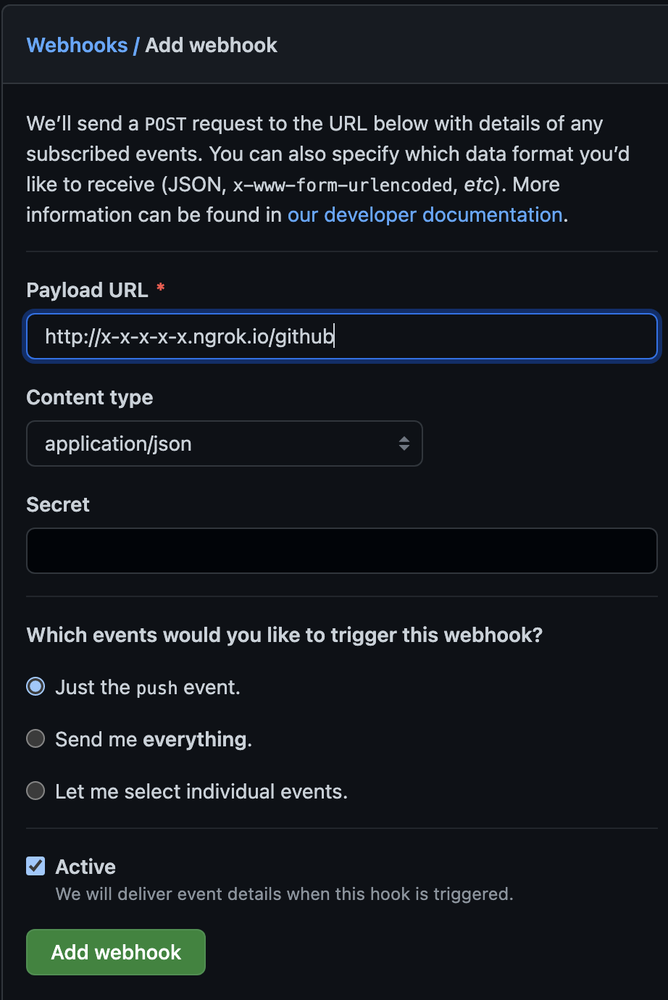

# DD2480 Group 28 CI Server

This is a CI Server for Python projects written by group 28 for the Software Engineering Fundamentals course at KTH. The server supports three core features of continuous integration:
<ol>
<li>syntax check: the CI server performs a syntax check on the Python code</li>
<li>automated tests: the CI server performs automated testing</li>
<li>notification: the CI server notifies the user of the CI results through email and on a webpage</li>

## Installation/ Usage
  
### Setting up the virtual environment

create a virtual environment in the directory using the command:

```
python -m venv env
```

navigate to the newly created env folder, and in the file env/bin/activate, add the lines:

```
export USER2480="EMAIL"
export PASS2480="PASSWORD"
```

where EMAIL and PASSWORD are the email/password combination of a gmail accout you wish to act as the web server notification email.

Activate the virtual environment by running the command:

```
source env/bin/activate
```

Use the package manager [pip](https://pip.pypa.io/en/stable/) to install the dependencies by running:


```
pip install -r requirements.txt
```

Finally, start the server by running 
```
python server.py
```


### Setting up ngrok

In a new terminal, install ngrok using:  

```
pip install ngrok
```

and run the command:

```
ngrok http 4567
```

copy the url of the form http://x-x-x-x-x.ngrok.io and navigate to the webhooks interface of the repo you wish to work with. Add the url as the Payload URL with '/github', and select the following options:


  
Once the webhook is added and the server is running, push events on github will trigger the CI suite! 

