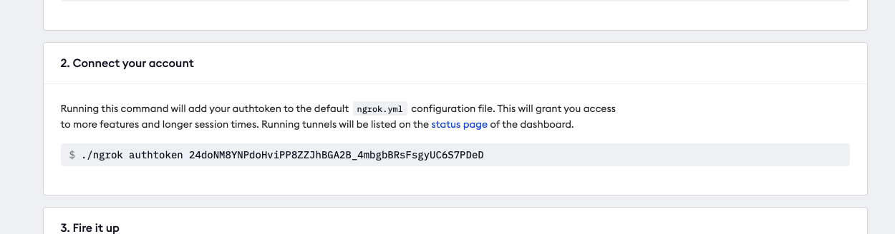

# Run through

## ngrok

Important to make an account as Gautam stated, or we will loose the servers every 2 hours. Not nice.

The important part is to connect your account with the `authtoken`.

[Sign up and download ngrok](https://dashboard.ngrok.com/get-started/setup) and 

## Flask:

[Install flask](https://flask.palletsprojects.com/en/2.0.x/installation/?highlight=venv): 

Don't forget the virtual environment! 


## Putting everything together
Run flask with:

```term
. venv/bin/activate

$ export FLASK_DEBUG=1
$ export FLASK_APP=server.py
$ flask run —port=4567
```

You should see:

```term
 * Serving Flask app 'server.py' (lazy loading)
 * Environment: production
   WARNING: This is a development server. Do not use it in a production deployment.
   Use a production WSGI server instead.
 * Debug mode: on
 * Running on http://127.0.0.1:4567/ (Press CTRL+C to quit)
 * Restarting with stat
 * Debugger is active!
 * Debugger PIN: 989-915-860
 ```

In a new terminal:

 ```
 ngrok http 4567
 ```
You should see:

 

Save that forwarding address for github. 
Here it is http://8fa5-212-100-98-175.ngrok.io.

## Github

In the settings of the repository, go to webhooks and create a new webhook with the forwarding address.


Set the "Which events would you like to trigger this webhook?" to "Send me everything". For the moment!


## Expected results:

The first thing is that github will ping your computer:

### flask terminal

A long json:

```
Path : /
{"form": {"payload": "{\"zen\":\"Approachable is better than simple.\",\"hook_id\":341544602,\"hook\":{\"type\":\"Repository\",\"id\":341544602,\"name\":\"web\",
```

and so on.

### ngrok terminal
In the ngrok terminal you should see:

```
HTTP Requests
-------------

POST /                         200 OK
```


 In a browser:

`localhost:4567`

You should see:

 

Opening an issue:

If you open an issue with a message, you can see it in the flask terminal too:

### flask terminal

You can see the message typed in the issue:


# TODO:

- [ ] find how to isolate those json messages!
  
  The correct syntax is apparently with a getter `.get()` (ex: `request.headers.get('X-Github-Event')`) but it is not straightforward to get nested objects
- [ ] find out how to send build + test instructions inside the server.

# Troubleshooting

## Adress already in use:

```
lsof -i :4567
```

and then
```
kill <PID>
```